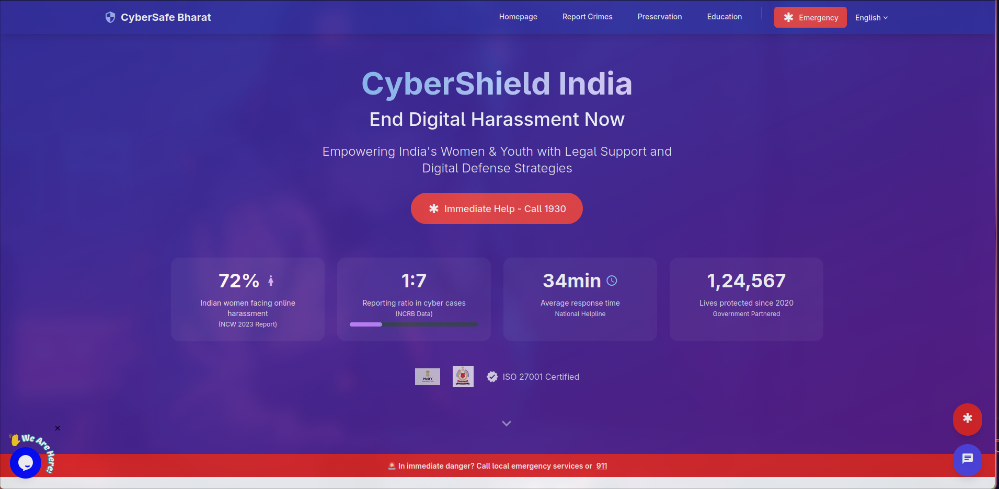
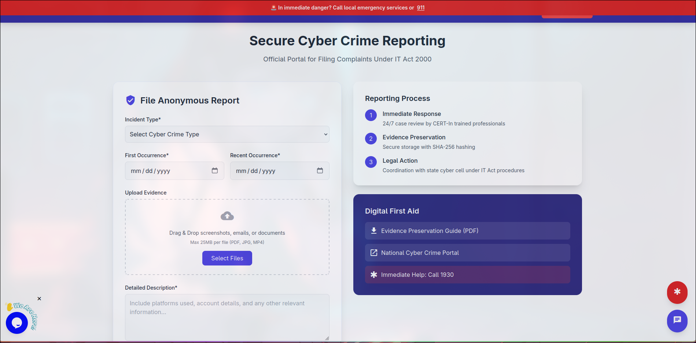
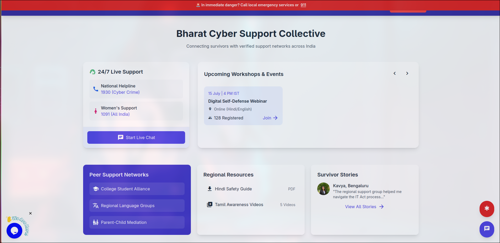
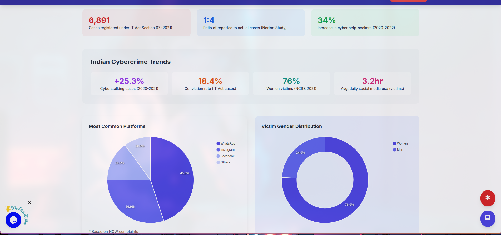
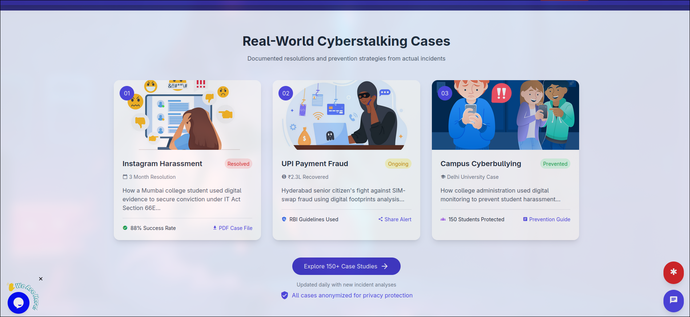
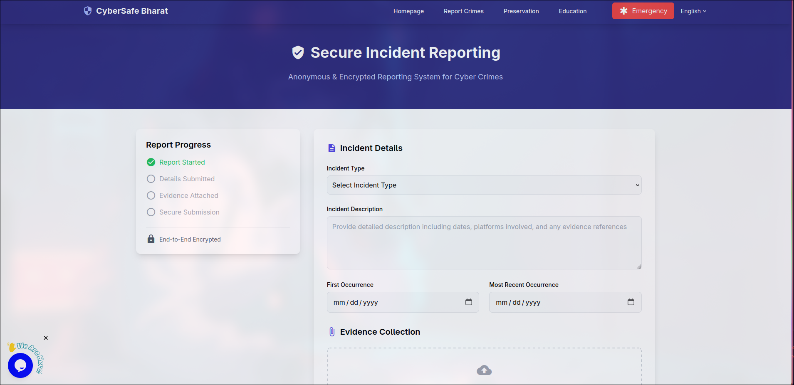
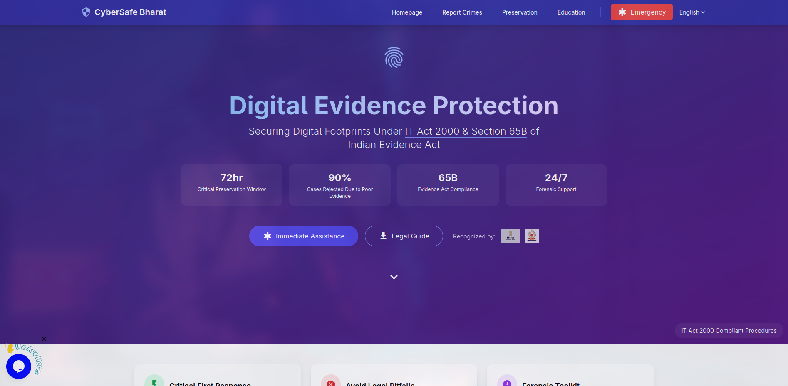
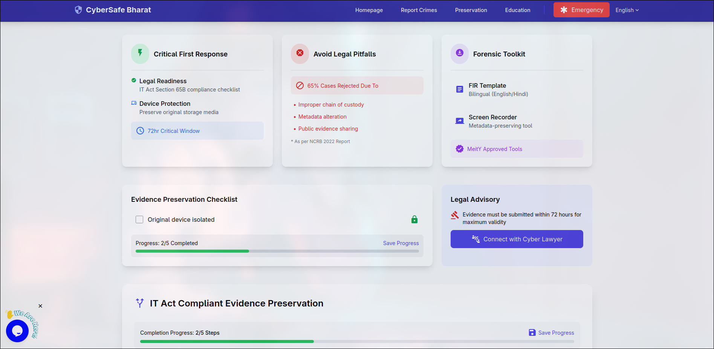
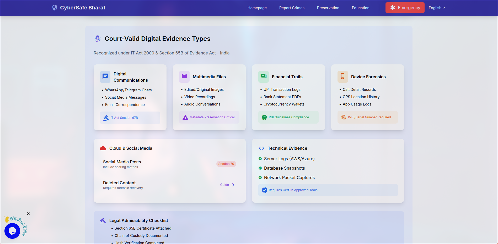
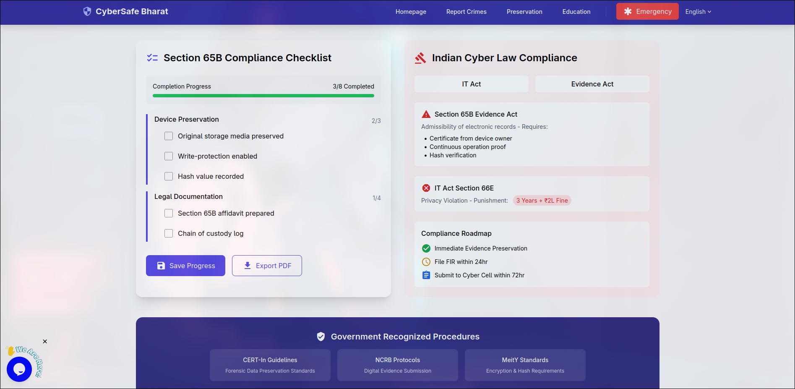

# Cyberstalking Awareness Portal 🌐🛡️

[](https://opensource.org/licenses/MIT)  


A platform for reporting and tracking cyberstalking incidents, with educational resources and support features.

 <!-- Add actual screenshot path -->

---

## 🚀 Quick Start: How to Run This Project

### 1. **Clone the repository**
```bash
git clone https://github.com/yuvrajsharmaaa/Cyber_Stalk.git
cd cyberstalking-awareness-portal
```

### 2. **Set up Python environment**
```bash
python -m venv venv
# On Windows:
venv\Scripts\activate
# On Mac/Linux:
source venv/bin/activate
```

### 3. **Install dependencies**
- Make sure your `requirements.txt` includes:
  ```
  fastapi
  uvicorn
  sqlalchemy
  psycopg2-binary
  aiofiles
  python-dotenv
  ```
- Then run:
  ```bash
  pip install -r requirements.txt
  ```

### 4. **Set up PostgreSQL**
- Install PostgreSQL and create a database (e.g., `cyberstalk`).
- Set your database URL in a `.env` file in the project root:
  ```
  DATABASE_URL=postgresql://postgres:<yourpassword>@localhost:5432/cyberstalk
  ```

### 5. **Initialize the database**
- If using SQLAlchemy's `Base.metadata.create_all`:
  ```python
  # In a Python shell:
  from main import Base, engine
  Base.metadata.create_all(bind=engine)
  ```

### 6. **Run the FastAPI server**
```bash
uvicorn main:app --reload
```
- Visit [http://127.0.0.1:8000/docs](http://127.0.0.1:8000/docs) for the API docs.
- Visit [http://127.0.0.1:8000/public/reporting.html](http://127.0.0.1:8000/public/reporting.html) for the reporting UI.

---

## 🛠 Tech Stack

- **Frontend:** HTML, Tailwind CSS, Vanilla JS, Material Icons
- **Backend:** FastAPI, SQLAlchemy ORM, Uvicorn, aiofiles
- **Database:** PostgreSQL

---

## 📝 Features

- Anonymous incident reporting with file upload
- Evidence securely stored in `/uploads`
- Admin can view reports via API or directly in the database
- Educational and support resources

---

## 🛡️ Security

- All sensitive data handled securely
- File uploads limited to 25MB
- Database credentials stored in `.env` (never commit this file!)

---

## 🤝 Contributing

1. Fork the repo and create a feature branch.
2. Make your changes.
3. Update `requirements.txt` if you add new dependencies:
   ```bash
   pip freeze > requirements.txt
   ```
4. Push and open a pull request.

---

## 📜 License

MIT License

---

**For any issues, open an issue or contact the maintainer.**

---

## 📚 Table of Contents
- [✨ Features](#-features)
- [🛠 Technologies](#-technologies)
- [📥 Installation](#-installation)
- [🚀 Usage](#-usage)
- [🤝 Contributing](#-contributing)
- [📜 License](#-license)
- [🙏 Acknowledgments](#-acknowledgments)
- [🌟 Future Enhancements](#-future-enhancements)

---

## ✨ Features

### 🔧 Core Functionalities
- 🚨 **Emergency Quick Exit** button
- 🔒 **Anonymous Incident Reporting** with encryption
- 📊 **Global Cyberstalking Statistics** dashboard
- 🧠 **Mental Health Resources** directory
- 🤝 **Peer Support Community** portal

### 🛡️ Awareness & Prevention
- 🌍 Interactive global heatmap visualization
- 📈 Real-time cyberstalking trend analysis
- 🛡️ Digital safety toolkit with platform-specific guides
- 🎓 Interactive learning modules and quizzes

### 🤗 Support Systems
- 📞 24/7 crisis hotline integration
- 👩‍⚖️ Legal resource finder
- 🧘‍♀️ Trauma recovery resources
- 📅 Community event calendar

---

## 📸 Screenshots

### 🏠 Home Page









---

### Cyber Crime Reporting

---

### Preservation









> ℹ️ *Screenshots are located in the `assets/screenshots/` directory. Make sure the images exist and are named correctly (e.g., `homepage.jpg`, `reporting-center.jpg`, `resources.jpg`).*


## 🛠 Technologies

### Frontend
- **Tailwind CSS** + **Meraki UI**
- **Material Design Icons**
- **Animate.css**
- **Vanilla JavaScript**

### Backend
- **Aquilify** + **ASGI**
- **Asyncio**
- **Pydantic**
- **Transutil**

### Database
- **Electrus - Nosql Database**

### Data Visualization *(Planned)*
- Chart.js
- D3.js
- Mapbox GL

### Security
- Client-side encryption
- Secure form handling
- Privacy-first design principles

---

## 📥 Installation

1. **Clone the repository**:
   ```bash
   git clone https://github.com/axiomchronicles/cyberstalking-awareness-portal.git
   cd cyberstalking-awareness-portal
   ```

2. **Install dependencies (for development)**:
   ```bash
   aquilify install -r
   ```

3. **Start local server**:
   ```bash
   aquilify runserver
   ```

4. **Access the portal** at:
   ```
   http://localhost:8000
   ```

---

## 🚀 Usage

### 🔴 Emergency Features
- Click the floating **red button** for immediate help
- Use the **Quick Exit** button (top-right) to instantly leave the site

### 📝 Reporting Process
- Go to **Safe Reporting Center**
- Select incident type from the dropdown
- Add detailed description
- Submit your **encrypted report**

### 📚 Resource Access
- Use navigation dropdowns to browse resources
- Filter content by category (Legal, Psychological, Technical)
- Bookmark pages using your browser

---

## 🤝 Contributing

We welcome contributions! Follow these steps:

1. Fork the repository  
2. Create your feature branch:
   ```bash
   git checkout -b feature/AmazingFeature
   ```
3. Commit your changes:
   ```bash
   git commit -m 'Add some AmazingFeature'
   ```
4. Push to the branch:
   ```bash
   git push origin feature/AmazingFeature
   ```
5. Open a **Pull Request**

### Priority Areas
- Data visualization implementation  
- Localization/multi-language support  
- Accessibility improvements  
- AI-powered risk assessment tools  

---

## 📜 License

Distributed under the **MIT License**.  
See [LICENSE](LICENSE) for more information.

---

## 🙏 Acknowledgments

- Statistical data from **WHO Cyberviolence Reports**
- UI components by **Meraki UI**
- Security guidelines from **Electronic Frontier Foundation**
- Crisis management protocols by **RAINN**

---

## 🌟 Future Enhancements

- Real-time threat level monitoring  
- Machine learning for behavioral pattern detection  
- Multi-language support  
- Mobile application integration  
- Blockchain-based evidence preservation  

> Together, we can make the internet safer for everyone 💜
